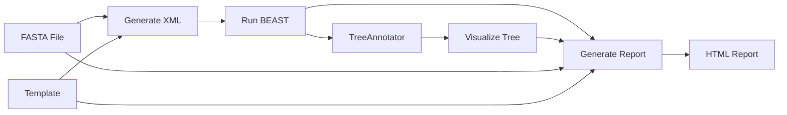

# BEAST-NF Pipeline

A Nextflow pipeline for Bayesian phylogenetic analysis using BEAST X with exponential growth coalescent model and time-scaled tree visualization.

## Overview

This pipeline performs:
1. **XML Generation**: Creates BEAST X input XML from aligned FASTA using beastgen with a user-specified template
2. **BEAST Analysis**: Runs Bayesian MCMC phylogenetic inference
3. **Tree Annotation**: Summarizes posterior tree distribution using TreeAnnotator
4. **Visualization**: Renders time-scaled tree using Python and Baltic library
5. **Report Generation**: Creates comprehensive HTML report with analysis results

## Requirements

### Software
- Nextflow (≥21.04.0)
- BEAST X (with beastgen and loganalyser utilities)
- Python 3.9+
- Biopython
- Baltic
- Matplotlib

### Installation

#### Using Conda
```bash
conda create -n beast-nf python=3.9 nextflow matplotlib biopython
conda activate beast-nf
pip install baltic
# Install BEAST X separately from https://www.beast2.org/
```

#### Using Docker
The pipeline includes Docker profile support. Docker images will be pulled automatically.

## Input Requirements

### FASTA File Format
- Aligned sequences in FASTA format
- Sequence names must contain dates in one of these formats:
  - `name|YYYY-MM-DD` or `name_YYYY-MM-DD` (full date)
  - `name|YYYY` or `name_YYYY` (year only)

Example:
```
>sample1|2023-01-15
ATCGATCGATCG...
>sample2|2023-03-20
ATCGATCGATCG...
```

### Template File
- BEAST XML template file for use with `beastgen`
- Template should include variable placeholders using `$(variable=default)` syntax
- See [templates/exponential_growth.xml](templates/exponential_growth.xml) for an example

Available template variables:
- `chain_length` - MCMC chain length
- `log_every` - Logging frequency
- `screen_every` - Screen output frequency

## Usage

### Basic Usage
```bash
nextflow run main.nf \
    --input aligned_sequences.fasta \
    --template templates/exponential_growth.xml
```

### With Custom Parameters
```bash
nextflow run main.nf \\
    --input aligned_sequences.fasta \\
    --template templates/exponential_growth.xml \\
    --outdir results \\
    --prefix my_analysis \\
    --chain_length 50000000 \\
    --burnin 10
```

### Using Docker
```bash
nextflow run main.nf \
    --input aligned_sequences.fasta \
    --template templates/exponential_growth.xml \
    -profile docker
```

### Using Conda
```bash
nextflow run main.nf \
    --input aligned_sequences.fasta \
    --template templates/exponential_growth.xml \
    -profile conda
```

### On HPC with SLURM
```bash
nextflow run main.nf \
    --input aligned_sequences.fasta \
    --template templates/exponential_growth.xml \
    -profile slurm
```

## Parameters

| Parameter | Default | Description |
|-----------|---------|-------------|
| `--input` | (required) | Path to aligned FASTA file |
| `--template` | (required) | Path to BEAST XML template file |
| `--outdir` | `results` | Output directory |
| `--prefix` | `beast_analysis` | Prefix for output files |
| `--chain_length` | `10000000` | MCMC chain length |
| `--log_every` | `1000` | Logging interval |
| `--screen_every` | `10000` | Screen output interval |
| `--burnin` | `10` | Burnin percentage for TreeAnnotator |
| `--max_cpus` | `4` | Maximum CPUs for BEAST |
| `--max_memory` | `8.GB` | Maximum memory for BEAST |
| `--max_time` | `48.h` | Maximum runtime for BEAST |

## Model Configuration

The pipeline uses `beastgen` to generate BEAST XML files from templates. The provided template ([templates/exponential_growth.xml](templates/exponential_growth.xml)) includes:
- **Substitution Model**: HKY with estimated frequencies
- **Clock Model**: Strict molecular clock
- **Tree Prior**: Exponential growth coalescent
- **Tip Dates**: Automatically parsed from sequence names by beastgen

### Priors (in default template)
- **Population Size**: 1/x prior
- **Growth Rate**: Laplace distribution (μ=0, scale=30.7)
- **Kappa**: Log-normal (mean=1.0, SD=1.25)
- **Clock Rate**: Uniform (0, 1)

### Creating Custom Templates
You can create your own BEAST XML templates for different models. Templates should:
1. Use `$(variable=default)` syntax for replaceable parameters
2. Include `<data id="alignment".../>` for sequence data
3. Include tip dates trait if needed
4. See BEAST X documentation for template format details

## Output Structure

```
results/
├── beast_analysis_report.html          # Comprehensive HTML report
├── xml/
│   └── beast_analysis.xml              # BEAST input XML
├── beast/
│   ├── beast_analysis.log              # Parameter log
│   ├── beast_analysis.trees            # Sampled trees
│   └── beast_analysis.*.log            # Additional logs
├── trees/
│   └── beast_analysis.mcc.tree         # Maximum clade credibility tree
├── figures/
│   ├── beast_analysis_timetree.png     # Time tree visualization
│   └── beast_analysis_timetree.svg     # SVG version
├── pipeline_report.html                # Pipeline execution report
├── timeline.html                       # Execution timeline
├── trace.txt                           # Resource usage trace
└── dag.svg                             # Pipeline DAG
```

## HTML Report

The pipeline generates a comprehensive HTML report (`beast_analysis_report.html`) that includes:

- **Input Data Summary**: Number of taxa, sequence length, template used
- **Taxa Table**: List of all taxa with sampling dates (if < 50 taxa)
- **Analysis Details**: Chain length, logging frequency, burn-in, runtime
- **Parameter Estimates**: Complete table from loganalyser with:
  - Mean, standard error, median
  - 95% HPD intervals
  - ESS values with quality indicators (Good/Fair/Low)
- **Tree Visualization**: Embedded SVG of the time-scaled MCC tree

Open the report in any web browser to view all results in one place.

## Workflow



## Example Analysis

### 1. Prepare your data
```bash
# Your aligned sequences with dates in names
head aligned_sequences.fasta
>virus1|2023-01-15
ATCGATCG...
>virus2|2023-02-20
ATCGATCG...
```

### 2. Run the pipeline
```bash
nextflow run main.nf \
    --input aligned_sequences.fasta \
    --template templates/exponential_growth.xml \
    --chain_length 50000000
```

### 3. Check results
```bash
# View HTML report in browser
open results/beast_analysis_report.html

# Or view individual files
cat results/beast/beast_analysis.log
cat results/trees/beast_analysis.mcc.tree
open results/figures/beast_analysis_timetree.png
```

## Monitoring

View pipeline progress:
```bash
# In terminal
tail -f .nextflow.log

# After completion
open results/pipeline_report.html
```

## Troubleshooting

### Date Parsing Issues
If dates aren't recognized, check sequence names match supported formats:
- `name|YYYY-MM-DD`
- `name_YYYY-MM-DD`
- `name|YYYY`
- `name_YYYY`

### Memory Issues
Increase memory for BEAST:
```bash
nextflow run main.nf --input data.fasta --max_memory 16.GB
```

### Long Runtime
For faster testing, reduce chain length:
```bash
nextflow run main.nf \
    --input data.fasta \
    --template templates/exponential_growth.xml \
    --chain_length 1000000
```

### BEAST X or beastgen Not Found
Ensure BEAST X is installed and tools are in PATH:
```bash
beastgen -version
beast -version
treeannotator -version
loganalyser -version
```

### Low ESS Values in Report
If the HTML report shows low ESS (Effective Sample Size) values:
- Increase chain length: `--chain_length 50000000`
- Check for convergence issues in Tracer
- Consider adjusting operators in the template

## Advanced Usage

### Custom Templates
Create your own BEAST XML template with different models:

```bash
# Copy and modify the example template
cp templates/exponential_growth.xml templates/my_model.xml
# Edit my_model.xml to change substitution model, tree prior, etc.

# Run with custom template
nextflow run main.nf \
    --input data.fasta \
    --template templates/my_model.xml
```

### Template Variables
Templates can use these variables (passed via beastgen):
- `$(chain_length=10000000)` - MCMC chain length
- `$(log_every=1000)` - Logging frequency
- `$(screen_every=10000)` - Screen output frequency

### Custom BEAST Parameters
To pass additional parameters to beastgen, modify the `GENERATE_XML` process in [main.nf](main.nf) to add more `-D` flags:

```groovy
beastgen \\
    -D chain_length=${params.chain_length} \\
    -D my_parameter=${params.my_parameter} \\
    ${template} \\
    ${fasta} \\
    ${params.prefix}.xml
```

### Custom Visualization
Edit the visualization script ([bin/visualize_tree.py](bin/visualize_tree.py)) to customize:
- Tree layout
- Color schemes
- Node annotations
- Figure dimensions

## Citation

If you use this pipeline, please cite:
- **BEAST**: Drummond AJ, Rambaut A (2007) BEAST: Bayesian evolutionary analysis by sampling trees. BMC Evolutionary Biology 7:214.
- **BEAST X**: Suchard MA, et al. (2018) Bayesian phylogenetic and phylodynamic data integration using BEAST 1.10. Virus Evolution 4(1): vey016.
- **Nextflow**: Di Tommaso et al. (2017) Nextflow enables reproducible computational workflows. Nature Biotechnology 35, 316–319.
- **Baltic**: https://github.com/evogytis/baltic

## License

MIT License

## Support

For issues and questions:
- Create an issue on GitHub
- Contact: ARTIC Network

## Acknowledgments

Developed for the ARTIC Network phylogenetic analysis workflows.
